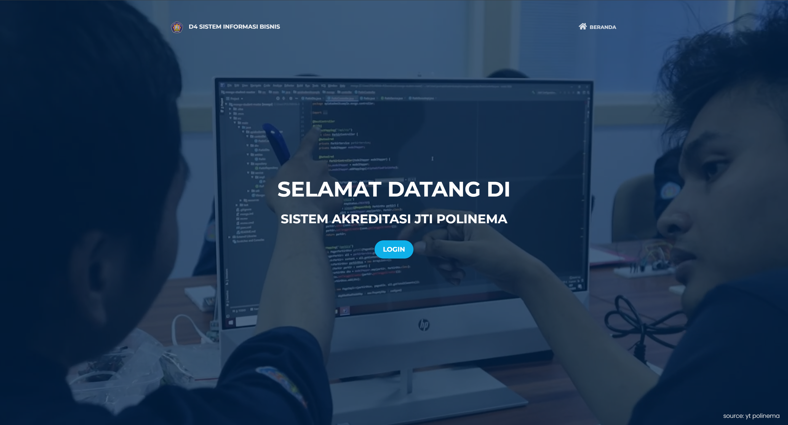
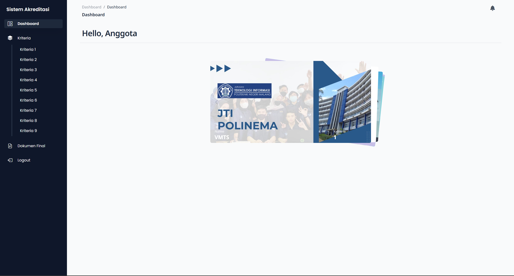
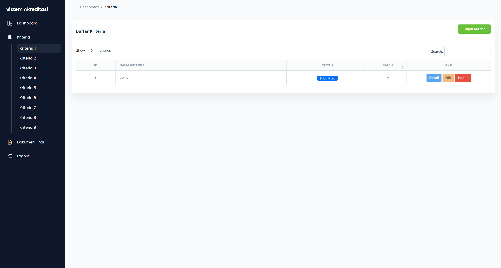
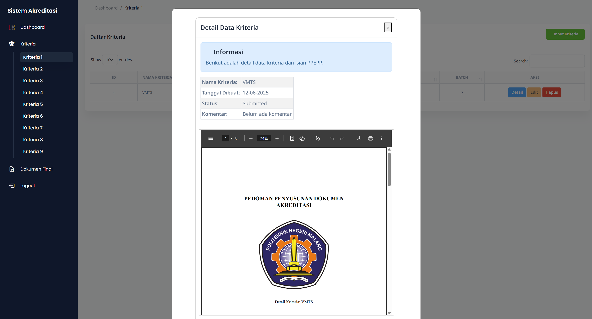
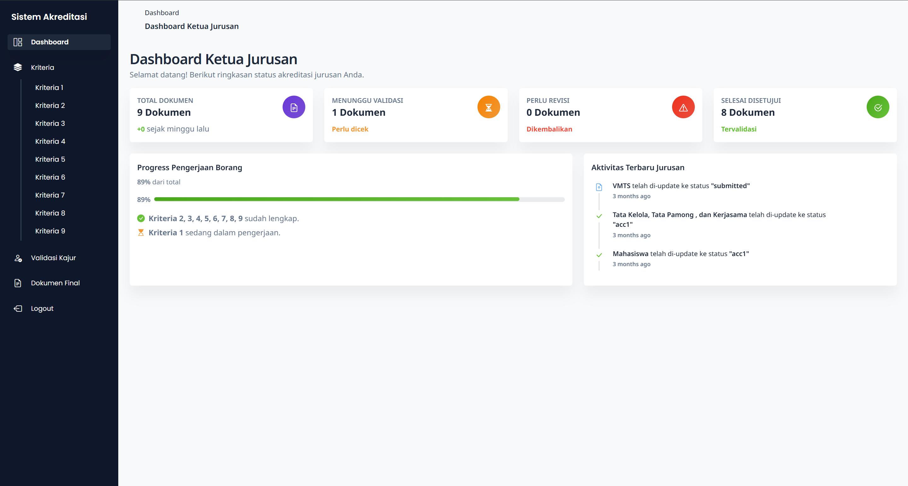
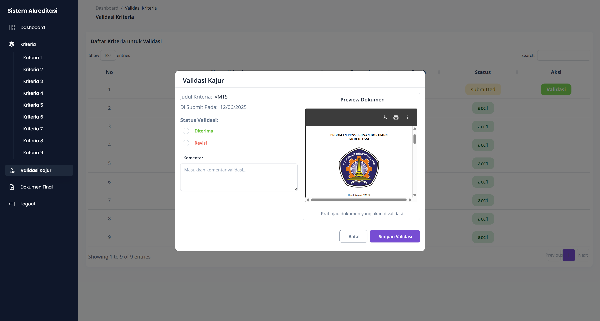
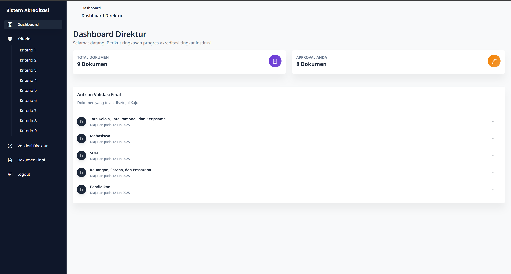
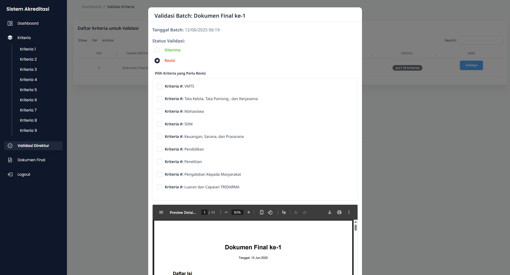
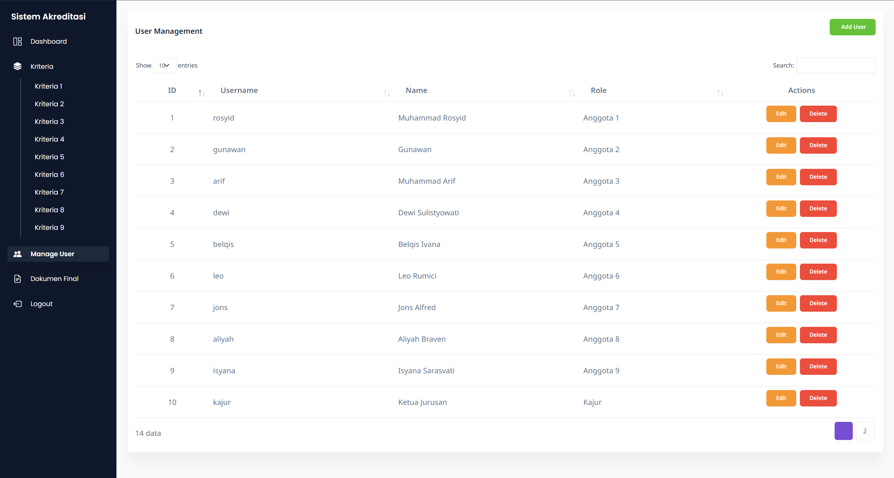
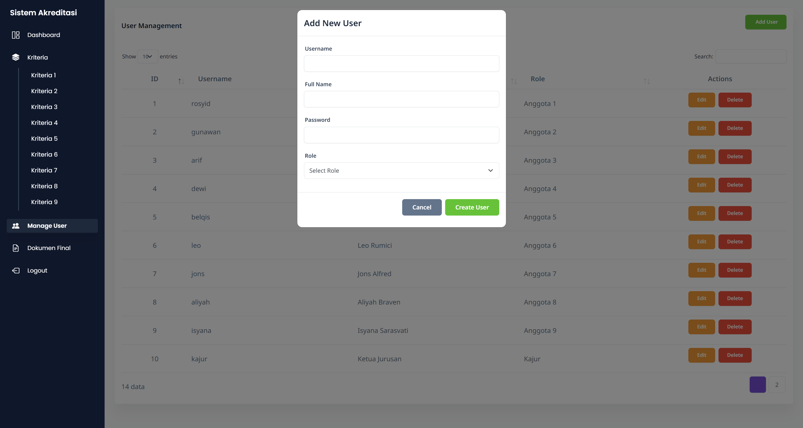

Deskripsi Proyek
    Sistem Akreditasi merupakan sebuah sistem informasi berbasis web yang dirancang untuk membantu proses pengumpulan, penilaian, dan pelaporan data akreditasi secara digital dan terstruktur. Sistem ini bertujuan untuk mempermudah para dosen (anggota tim akreditasi) dalam menginput dan mengelola data eviden berdasarkan kriteria yang ditentukan, serta memungkinkan validator atau koordinator jurusan untuk memverifikasi data tersebut secara efisien.
    Dengan adanya sistem ini, diharapkan proses akreditasi tidak lagi dilakukan secara manual menggunakan dokumen fisik, sehingga lebih menghemat waktu, meminimalisir kesalahan input, dan meningkatkan transparansi serta akuntabilitas data

Tujuan dan Sasaran
        Tujuan utama dari proyek ini adalah merancang dan mengimplementasikan sistem akreditasi berbasis web yang dapat mendukung proses akreditasi secara lebih efisien, terdokumentasi, dan terstandarisasi di lingkungan institusi pendidikan tinggi. 
    Sasaran khusus proyek ini meliputi:
    a.	Menyediakan platform input data akreditasi sesuai kriteria BAN-PT.
    b.	Memungkinkan user dengan role tertentu (A1–A5) untuk mengunggah, mengedit, atau menghapus data akreditasi.
    c.	Menyediakan fitur validasi data oleh Koordinator Jurusan (KJR) sebelum finalisasi.
    d.	Menghasilkan laporan eviden yang dapat diunduh dalam format PDF.
    e.	Menyediakan histori perubahan data untuk kebutuhan tracking revisi.

Dokumentasi Proyek

    Halaman Depan

    Login sebagai Anggota
       Dashboard 

       Page untuk input data

       Preview Dokumen

    
    Login sebagai Kajur (Validator 1)
       Dashboard

       Page untuk validasi Dokumen

    
    Login sebagai Direktur (Validator 2)
       Dashboard

       Page untuk validasi Dokumen

    
    Login sebagai Super Admin
       Page untuk edit user

        

    
    Melihat Dokumen Final yang telah disetujui oleh semua validator (semua user bisa melihat)

